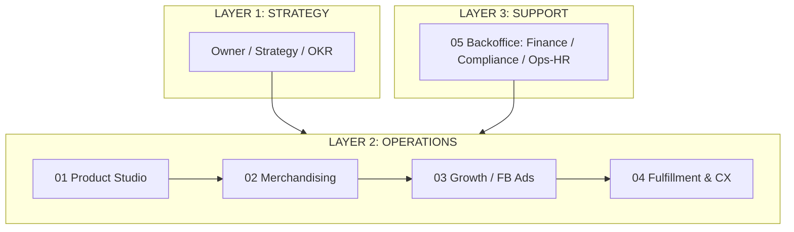

# DAKOfits — Value Chain (Porter, 3 Layer)

**Phiên bản:** 1.0 · **Ngày:** 2026-06-23 · **Industry:** POD e-commerce (AOP activewear)

---

## ASCII Value Chain

```
[Value Chain: DAKOfits — POD AOP Activewear, US + EU]

┌─────────────────────────────────────────────────────────────────┐
│  LAYER 1: STRATEGY                                                │
│  Owner (CEO) → Strategy / OKR → Budget allocation                │
│  Output: Vision, Quarterly OKR, Ad budget, Niche bets            │
├─────────────────────────────────────────────────────────────────┤
│  LAYER 2: OPERATIONS (Primary — POD value chain)                 │
│                                                                   │
│  ┌────────────┐  ┌────────────┐  ┌──────────┐  ┌──────────────┐ │
│  │ 01 Product │→│ 02 Merch-  │→│ 03 Growth │→│ 04 Fulfill   │ │
│  │ Studio     │  │ andising   │  │ (FB Ads) │  │ & CX         │ │
│  │ niche+AOP  │  │ catalog+   │  │ creative+│  │ order route  │ │
│  │ design     │  │ page+price │  │ email    │  │ + support    │ │
│  └────────────┘  └────────────┘  └──────────┘  └──────────────┘ │
│   PRD-001..004    MER-001..006    GRW-001..005   FUL-001..004   │
├─────────────────────────────────────────────────────────────────┤
│  LAYER 3: SUPPORT                                                 │
│  ┌──────────────── 05 Backoffice ─────────────────┐             │
│  │ Finance (BCK-001/002/003) · Compliance GPSR/GDPR │           │
│  │ (BCK-004/005) · Ops-HR AI Workforce (BCK-006)    │           │
│  └──────────────────────────────────────────────────┘           │
│   ↑ Hỗ trợ toàn bộ Layer 2 ↑                                    │
└─────────────────────────────────────────────────────────────────┘
```

## Mermaid



## Cross-department flow (upstream → downstream)
- **Product Studio** → cleared niche + AOP design → **Merchandising**
- **Merchandising** → live product + product page → **Growth**
- **Growth** → đơn hàng từ ads → **Fulfillment & CX**
- **Fulfillment & CX** → fee/cost data → **Backoffice (Finance)**
- **Backoffice (Compliance)** → GPSR clearance → gate cho **Merchandising publish** & **Growth ads**
